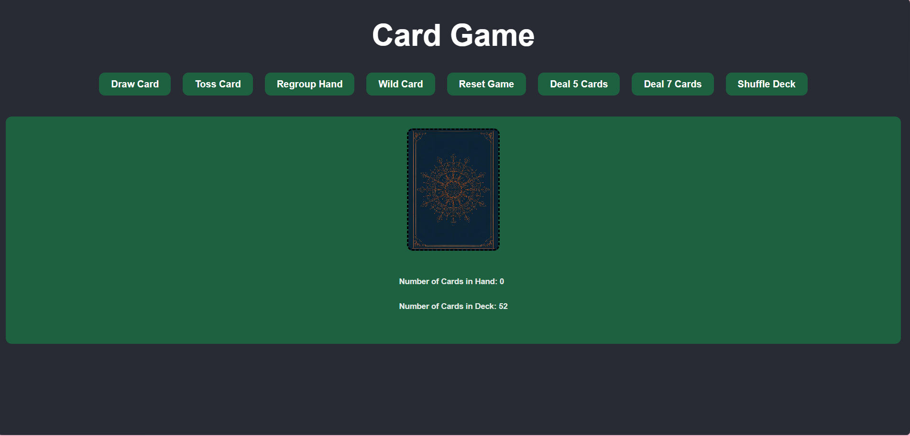
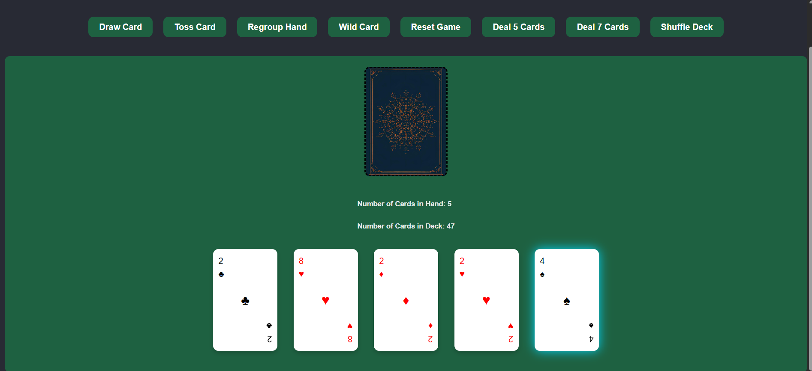
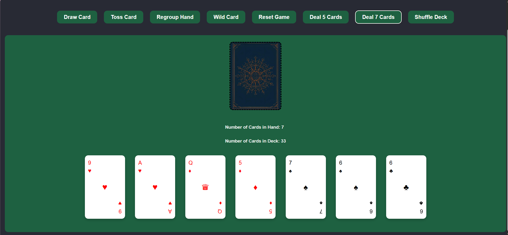

# ♣️ Reactive Deck – Card Manipulation App

A fully interactive React application for manipulating a standard deck of playing cards. This project demonstrates state management, component-based architecture, and dynamic UI behavior using modern React practices.

## 🎯 Features
- 🃏 Standard 52-Card Deck System
- Generates a standard deck (A–K, ♥ ♦ ♣ ♠)
- Fisher-Yates shuffle algorithm for true randomness
  
## 🎴 Card Interactions
- Click deck to draw cards
- Select (pick) cards with visual highlighting
- Swap cards by selecting two cards
- Toss cards (remove permanently from the game)

## 🎲 Game Controls
- Deal 5 / Deal 7 – Instantly deal new hands
- Shuffle Deck – Randomizes remaining cards
- Reset Game – Restores full 52-card deck
- Regroup – Shuffles cards in hand
- Wildcard – Adds a random card (duplicates allowed)

## ✨ Visual Enhancements
- Styled playing cards with suit-based coloring
- Hover animations and glow effects
- Special styling for wildcard cards
- Responsive layout with modern UI design

## 🧠 Tech Stack
- React (Functional Components + Hooks)
- JavaScript (ES6+)
- CSS3 (Flexbox, transitions, shadows)
- Vite (Fast development environment)

## 📁 Project Structure
```
src/
│
├── Components/
│   └── Card.jsx          # Card display component (stateless)
│
├── utils/
│   └── cardUtils.js      # Deck creation & shuffle logic
│
├── assets/
│   └── playing-cards-cover.png
│   └── deal5.png
│   └── deal7.png
│   └── home.png

│
├── App.jsx               # Main application logic
├── App.css               # Styling
├── index.css             # Styling
└── main.jsx              # Entry point

```

## ⚙️ How It Works
### 🔹 State Management
deck → Remaining cards
hand → Cards currently displayed
pickedCardId → Currently selected card

### 🔹 Core Logic
Draw Card: Removes a card from the deck and adds it to the hand
Swap Cards: Clicking a second card swaps positions in the hand
Toss: Removes selected card permanently
Reset: Rebuilds a fresh 52-card deck

## 🧪 Testing & Debugging
- Verified shuffle randomness using console logging
- Tested edge cases:
  * Empty deck
  * Multiple swaps
  * Toss + Reset behavior
- Ensured React state immutability using spread operators

## 🎥 Demo & Reflection Highlights

[Watch Demo Video](https://youtu.be/jKZhmIjrasM)

During development, key learning moments included:

- Debugging incorrect reset logic where tossed cards were not restored
- Implementing swap logic using array index manipulation
- Understanding state immutability in React ([...array])
- Experimenting with CSS effects for card styling and glow
  
## 🚀 Getting Started
#### Clone the repo
git clone https://github.com/stat3m3nt/reactive-deck.git

#### Navigate into project
cd reactive-deck

#### Install dependencies
npm install

#### Run development server
npm run dev

## 📸 Screenshots








## 💡 Future Improvements
- Animate card dealing and swapping
- Add sound effects for interactions
- Display deck preview (top card)
- Implement scoring or game rules
  
## 👨‍💻 Author
Andrew Evboifo
Full-Stack Developer | React | APIs | JavaScript

GitHub: https://github.com/stat3m3nt
